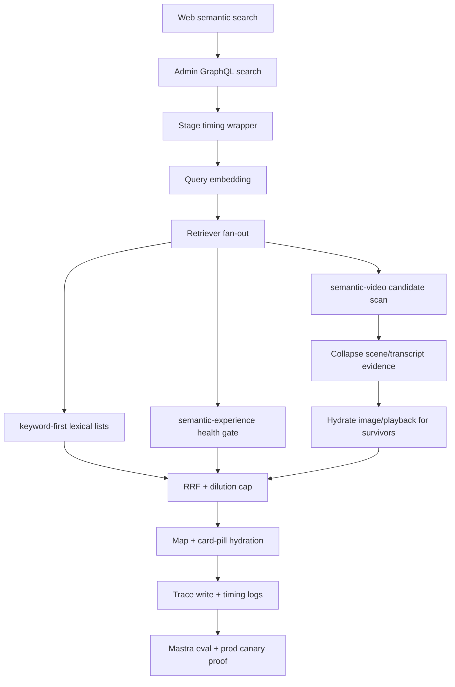

# fix: Speed Semantic Search Without Relevance Degradation

## Summary

Improve Web/Admin semantic search latency through measured vertical slices:
repair observability first, optimize the semantic-video hot query without
changing public result shape, guard sparse semantic-experience results, and
prove relevance with Mastra search evals before treating the work as shippable.

---

## Problem Frame

Web now calls Admin search with `mode="keyword-first"` for the semantic search
path. Production probes showed successful responses, but the path can take
roughly 4-7 seconds and sometimes feels stuck behind the search modal skeleton.
The earlier bounded timeout/degradation approach is out of scope: the goal is
to keep or improve result quality while making the normal path faster.

The important correction from production/docs review is that old OpenAI vectors
may remain in the database. The live retrievers must not mix vector spaces, and
they already filter to the current gateway provider tuple. Therefore old-vector
deletion is a possible index/table-bloat cleanup, not the primary definition of
correctness or the first speed fix.

---

## Requirements

**Performance and Proof**

- R1. The normal semantic search path must not rely on retriever timeouts or
  intentional degraded results as the primary speed mechanism.
- R2. Each implementation slice must have before/after timing proof from local
  tests or production-shaped probes before it is considered done.
- R3. Production proof must include Web-path or Admin GraphQL timings for
  representative canaries such as `the bible project`, `jesus`, and
  `hope when life is hard`.

**Relevance Safety**

- R4. Search must keep provider-bound semantic correctness: query and stored
  vectors searched together must share provider, model, dimensions, native
  dimensions, and transform-version semantics.
- R5. Mastra search evals must pass with no relevance regression before ranking
  or retrieval changes are considered shippable.
- R6. Sparse semantic sources must not get normal RRF influence when their
  corpus is too small to be meaningful for the requested locale.

**Contract and Operations**

- R7. Public REST, GraphQL, and Web search response shapes must remain stable.
- R8. Existing keyword-first behavior, dilution-cap behavior, and the
  `semantic-video` top-level retriever label must remain stable.
- R9. Search trace and timing observability must be trustworthy enough to
  explain slow searches without ad hoc manual Railway probes.
- R10. Any production data/index cleanup must have rollback or non-destructive
  validation before execution.
- R11. With Algolia disabled or bypassed by a content-type filter, Web semantic
  search should meet the fast-path budget: p95 under 2 seconds for warm canary
  requests, no single canary above 5 seconds, and zero 15-second Admin GraphQL
  timeouts.
- R12. LaunchDarkly only selects the result backend. One page sequence must not
  append Algolia and semantic results together if the flag flips between page
  loads.
- R13. `searchMode` remains only the embedding-degradation signal. Backend
  identity stays in Web `resultSource` and internal trace/timing metadata.
- R14. Release proof must combine relevance proof with operational proof: no
  retriever failures, no trace-persistence blind spot, and no Web/Admin timeout
  on the canary set.

---

## Key Technical Decisions

- **Instrument before optimizing:** Fix broken search trace writes and add
  coarse per-stage timing so later work can prove whether latency moved from
  embedding, retriever SQL, fusion, hydration, trace persistence, or Web/Admin
  transport.
- **Optimize semantic-video by moving hydration after collapse first:** The
  production-shaped plan showed repeated lateral image/dub lookups and repeated
  language scans before candidates were narrowed. The first safe slice should
  preserve the existing best-evidence-per-video candidate semantics, then
  hydrate image/playback fields and `embedding::text` only for the survivor
  window.
- **Do not equate old-vector deletion with search correctness:** The provider
  filters already prevent semantic mixing. Prefer provider/locale-scoped
  partial HNSW indexes or EXPLAIN-backed query refactors before destructive
  vector deletion.
- **Guard sparse semantic-experience as quality safety:** A tiny gateway
  experience corpus can produce high-RRF irrelevant results. The retriever
  should either pass a corpus-health threshold or stay out of RRF for that
  locale until the corpus is meaningful.
- **Use Mastra evals as the relevance gate:** Unit tests can prove query shape
  and orchestration, but relevance changes need the existing Mastra offline
  search eval path and canary queries.

---

## High-Level Technical Design

The optimization target is the middle of the path. Web behavior and response
contracts stay fixed; Admin internals become easier to time, cheaper to query,
and harder to pollute with low-signal semantic lists.

---

## Scope Boundaries

In scope:

- Fixing search trace persistence and adding timing summary fields/logs.
- Refactoring `searchVideoSemantic` so expensive hydration happens after
  collapsed candidates are selected.
- Guarding or downweighting `semantic-experience` when corpus health is below a
  documented threshold.
- Adding EXPLAIN/probe scripts or docs needed to compare old/new production
  query behavior.
- Running targeted Admin tests, typecheck, lint, production-shaped probes, and
  Mastra search evals when credentials/runtime are available.

Deferred to follow-up work:

- Destructive deletion of old OpenAI vectors. Treat this as an optional
  database-maintenance slice after non-destructive indexing/refactor proof.
- Full all-locale embedding backfill decisions. This plan only needs corpus
  health checks for search ranking safety.
- New public search UI states, result fields, or user-visible mode selectors.
- Replacing keyword-first, RRF, or the dilution-cap model wholesale.

---

## Implementation Units

### U1. Restore Trustworthy Search Timing and Trace Writes

- **Goal:** Make production search observability reliable enough to prove where
  latency is spent and stop trace-write failures from obscuring real issues.
- **Requirements:** R2, R3, R9
- **Dependencies:** None
- **Files:**
  - `apps/admin/src/services/search-trace.service.ts`
  - `apps/admin/src/services/search-trace.service.test.ts`
  - `apps/admin/src/services/search-trace-health.ts`
  - `apps/admin/src/services/hybrid-search.service.ts`
  - `apps/admin/src/services/hybrid-search.service.test.ts`
  - `apps/admin/src/graphql/queries/hybrid-search.ts`
  - `apps/admin/src/app/api/search/route.ts`
- **Approach:** Reproduce the current `PrismaClientValidationError` locally or
  against production metadata, then fix the trace writer or schema/client drift
  that causes it. Add a small internal timing summary that can record
  `embeddingMs`, per-retriever elapsed time, fusion/dedup/mapping time,
  hydration time, and trace-write outcome without exposing raw query text,
  vectors, scores, bearer identity, or user identifiers.
- **Patterns to follow:** Existing search trace privacy constraints in
  `apps/admin/src/services/search-trace.service.ts`; structured search logs in
  `apps/admin/src/graphql/queries/hybrid-search.ts`; health counters in
  `apps/admin/src/services/search-trace-health.ts`.
- **Test scenarios:**
  - `recordSearchTraceSafely` succeeds for a normal GraphQL search trace using
    the current `SearchTraceAggregate` unique key shape.
  - A raw trace write failure records failure health without rejecting the
    search response.
  - A search with mocked slow retrievers emits timing fields that identify the
    slow retriever.
  - Timing output contains no query text, vectors, bearer tokens, user ids, or
    result scoring payloads.
- **Verification:** Search trace failures disappear in production logs for new
  searches, and canary searches produce stage timing evidence.

### U2. Refactor Semantic-Video Query Hydration After Candidate Collapse

- **Goal:** Reduce semantic-video SQL work while preserving result shape and
  relevance semantics.
- **Requirements:** R1, R2, R4, R7, R8
- **Dependencies:** U1 for proof; may begin with local SQL characterization
  before U1 fully deploys.
- **Files:**
  - `apps/admin/src/services/hybrid-search-retrievers.ts`
  - `apps/admin/src/services/hybrid-search-retrievers.test.ts`
  - `apps/admin/src/services/transcript-embedding-ingest.contract.test.ts`
  - `docs/solutions/architecture-patterns/admin-semantic-video-transcript-evidence-pattern.md`
- **Approach:** Keep `semantic-video` as one retriever. After feat-192, preserve
  the transcript-backed semantic-video topology and do not reintroduce scene
  retrieval as a fallback. Inside SQL, preserve the existing
  best-evidence-per-video winner shape for the default path, union those
  winners, and only then hydrate image URL, playback ID, and `embedding::text`
  for the bounded survivor set. Resolve matching requested-language ids once
  rather than scanning `language` inside each lateral lookup, but keep all ids
  for the BCP-47 tag because `language.bcp47` is not unique. Treat any
  HNSW-first raw nearest-neighbor source window as a follow-up optimization that
  requires duplicate-heavy relevance proof or adaptive top-up.
- **Execution note:** Start with characterization tests around SQL shape and
  result mapping; then refactor one query shape at a time and compare
  production-shaped EXPLAIN output. Do not ship an HNSW-first raw source window
  until it has a distinct-video guarantee or duplicate-heavy Mastra
  no-regression proof.
- **Patterns to follow:** `mixVideoSemanticEvidenceRows` in
  `apps/admin/src/services/hybrid-search-retrievers.ts`; pgvector HNSW cautions
  in `docs/solutions/performance-issues/pgvector-hnsw-index-bypass-with-where-filter-20260415.md`.
- **Test scenarios:**
  - The query no longer performs image/dub lateral hydration or
    `embedding::text` projection inside the scene/transcript source-collapse
    work.
  - The query still filters by current gateway provider tuple for scene and
    transcript evidence.
  - A transcript-only match and scene-only match still return one
    `VideoSemanticResult` with the same public fields.
  - Mixed scene+transcript evidence still produces one row per video with the
    existing bounded agreement bonus.
  - `embeddingText` remains present for final semantic-video rows if dedup
    still requires it.
- **Verification:** `EXPLAIN (ANALYZE, BUFFERS)` on production-shaped data shows
  no repeated per-evidence `language` scans and no large external sort caused by
  early `embedding::text` projection. Live canary timings improve or stay flat.

### U3. Add Corpus-Health Guard for Semantic Experience

- **Goal:** Prevent tiny semantic-experience corpora from contributing noisy
  high-RRF results while keeping keyword experience search available.
- **Requirements:** R5, R6, R7, R8
- **Dependencies:** U1 for timing/proof visibility
- **Files:**
  - `apps/admin/src/services/hybrid-search.service.ts`
  - `apps/admin/src/services/hybrid-search.service.test.ts`
  - `apps/admin/src/services/hybrid-search-retrievers.ts`
  - `apps/admin/src/services/hybrid-search-retrievers.test.ts`
  - `apps/admin/src/services/search-eval/fingerprint.ts`
- **Approach:** Add a cheap locale/provider corpus-health check for
  `experience_locale` gateway embeddings. If the usable corpus is below the
  threshold, skip `semantic-experience` for that request while preserving
  `keyword-experience`. Record the skip in internal trace/timing metadata so it
  is visible as an intentional quality guard, not a retriever failure.
- **Patterns to follow:** Existing embedding-degradation distinction between
  `searchMode` and input `mode`; empty-list dropping before RRF; existing
  search-eval fingerprinting.
- **Test scenarios:**
  - With healthy corpus count, `semantic-experience` is dispatched normally.
  - With sparse corpus count, `semantic-experience` contributes no list and
    `keyword-experience` still runs.
  - Sparse-corpus skip does not mark the whole response `keyword-only` or
    failed.
  - Debug/timing metadata can show the skip without exposing private data.
- **Verification:** The `the bible project` canary no longer promotes an
  unrelated experience solely from a tiny semantic-experience corpus; Mastra
  evals show no relevance regression.

### U4. Add Non-Destructive Provider-Scoped Index Verification

- **Goal:** Decide whether provider/locale partial HNSW indexes are needed
  before considering old-vector deletion.
- **Requirements:** R2, R4, R10
- **Dependencies:** U2 query shape should be known before final index shape.
- **Files:**
  - `apps/admin/prisma/migrations/*`
  - `apps/admin/src/services/hybrid-search-retrievers.test.ts`
  - `docs/roadmap/content-discovery/feat-175-admin-semantic-search-latency.md`
  - `docs/solutions/performance-issues/pgvector-hnsw-index-bypass-with-where-filter-20260415.md`
- **Approach:** Compare old/new EXPLAIN plans first. If the planner still
  ignores useful HNSW paths because provider/locale filters live on the vector
  table, add narrowly scoped partial HNSW indexes for the current gateway
  contract and high-traffic locales instead of deleting legacy vectors. Defer
  destructive deletion until backup, rollback, and post-index evidence show it
  is still necessary.
- **Test scenarios:**
  - Migration defines indexes only for current provider/model/dimensions and
    selected locales, with existing global indexes left as fallback.
  - EXPLAIN-format verification references the expected index names for
    indexed locales.
  - Unknown locales remain functional even if they fall back to slower plans.
- **Verification:** Production-shaped EXPLAIN shows index scans for current
  gateway rows on indexed locales, and live canary timings improve or stay flat.

### U5. Run Mastra Relevance Eval and Production Canary Proof

- **Goal:** Prove the speed fix does not degrade result quality.
- **Requirements:** R2, R3, R5, R11, R14
- **Dependencies:** U1, U2, U3, and optionally U4
- **Files:**
  - `apps/mastra/src/scripts/run-content-embedding-search-eval.ts`
  - `apps/mastra/src/mastra/workflows/offline-search-eval.ts`
  - `docs/search-eval-reports/`
  - `docs/roadmap/content-discovery/feat-175-admin-semantic-search-latency.md`
- **Approach:** Run the existing Mastra offline search eval path against the
  modified Admin search surface, using the same provider-bound assumptions as
  the gateway search docs. Pair that with production canaries that capture
  latency and top results for known queries. Treat any judged loss, search
  failure, or canary relevance regression as blocking.
- **Patterns to follow:** Provider-bound eval guidance in
  `docs/solutions/architecture-patterns/provider-bound-content-embedding-backfill-gate-pattern.md`;
  historical eval summaries in `docs/search-eval-reports/`.
- **Test scenarios:**
  - Eval run records no search failures.
  - Eval run records no losses against the chosen baseline.
  - Canary queries keep or improve expected top results.
  - Timing proof shows median and slow canary latency improved or stayed within
    the previous envelope.
- **Verification:** A sanitized eval report or summary is saved when the run is
  meaningful and safe to commit; otherwise the exact missing runtime/credential
  blocker is recorded.

### U6. Guard LaunchDarkly Backend Source Separation

- **Goal:** Ensure Web search does not mix Algolia and semantic result pages
  while performance work is underway.
- **Requirements:** R11, R12, R13
- **Dependencies:** None; can land independently if source mixing risk appears
  in current tests.
- **Files:**
  - `apps/web/src/lib/search-actions.ts`
  - `apps/web/src/lib/search.ts`
  - `apps/web/src/lib/search.test.ts`
  - `apps/web/src/components/FloatingSearchProvider.tsx`
- **Approach:** Verify existing behavior first. If the load-more flow can append
  a page from a different `resultSource` after a LaunchDarkly flag flip, reset
  the sequence or reject the append so a page never blends semantic and Algolia
  results.
- **Test scenarios:**
  - Flag off calls semantic search, returns `resultSource: "semantic"`, and
    sends Admin `mode: "keyword-first"`.
  - Flag on with no content type returns Algolia video results only.
  - A content-type-filtered request still uses semantic search.
  - If a later page reports a different `resultSource`, the client resets or
    refuses to append mixed-source results.
- **Verification:** Existing web search contract tests pass, and the semantic
  canary path remains the one measured by U5.

---

## Operational Notes

- Do not run destructive old-vector deletion as part of the first fix. If it
  remains attractive after U1-U4, require a production backup/vector export,
  row-count baselines, EXPLAIN evidence, and rollback notes.
- Keep the Web/Admin deploy order receiver-first for GraphQL shape changes. This
  plan should avoid public shape changes, so deploy ordering should be simpler
  than the keyword-first opt-in.
- Gate hard latency on `en`, `es`, and `fr` first because existing partial HNSW
  coverage and search history emphasize those locales. Require functional and
  no-regression proof for `pt`, `de`, `ru`, and `ar` until index coverage is
  explicitly expanded.
- Production Railway probes may be used for verification, but logs and reports
  must not include project tokens, API keys, raw vectors, raw query text beyond
  already-visible canary strings, bearer keys, or user identifiers.

---

## Risks & Dependencies

- The current local worktree contains an unproven bounded nearest-neighbor
  rewrite. It must be reviewed against this plan and either replaced or proven;
  do not assume it is already the final U2 implementation.
- The search trace failure may be caused by production schema/client drift. If
  so, U1 may need a migration/deploy fix before timing data becomes reliable.
- Provider-scoped partial indexes can improve planner behavior but increase
  index maintenance cost. They should be added only after EXPLAIN shows query
  shape alone is insufficient.
- Mastra evals require environment variables and reachable Admin/Mastra search
  eval endpoints. If those are unavailable locally, the work can still ship only
  after a documented production or staging eval run.

---

## Sources & Research

- `apps/admin/src/services/hybrid-search.service.ts`
- `apps/admin/src/services/hybrid-search-retrievers.ts`
- `apps/admin/src/services/search-trace.service.ts`
- `apps/admin/src/graphql/queries/hybrid-search.ts`
- `apps/web/src/lib/search.ts`
- `docs/plans/2026-06-09-001-feat-web-search-keyword-first-plan.md`
- `docs/plans/2026-05-21-001-feat-mixed-scene-transcript-video-semantic-search-plan.md`
- `docs/solutions/platform/admin-hybrid-search-keyword-first-r4-extension-pattern.md`
- `docs/solutions/architecture-patterns/admin-semantic-video-transcript-evidence-pattern.md`
- `docs/solutions/performance-issues/pgvector-hnsw-index-bypass-with-where-filter-20260415.md`
- `docs/solutions/architecture-patterns/provider-bound-content-embedding-backfill-gate-pattern.md`
- `docs/search-eval-reports/2026-06-03-ai-gateway-local-gate-summary.md`
